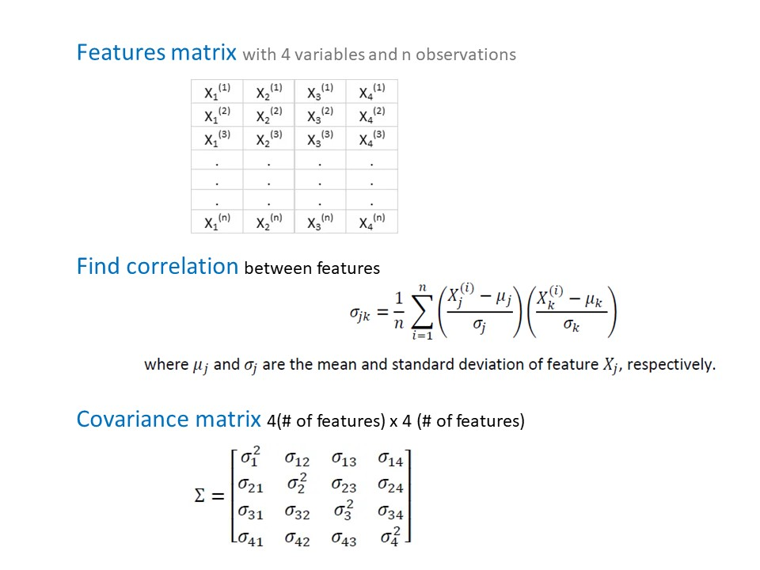
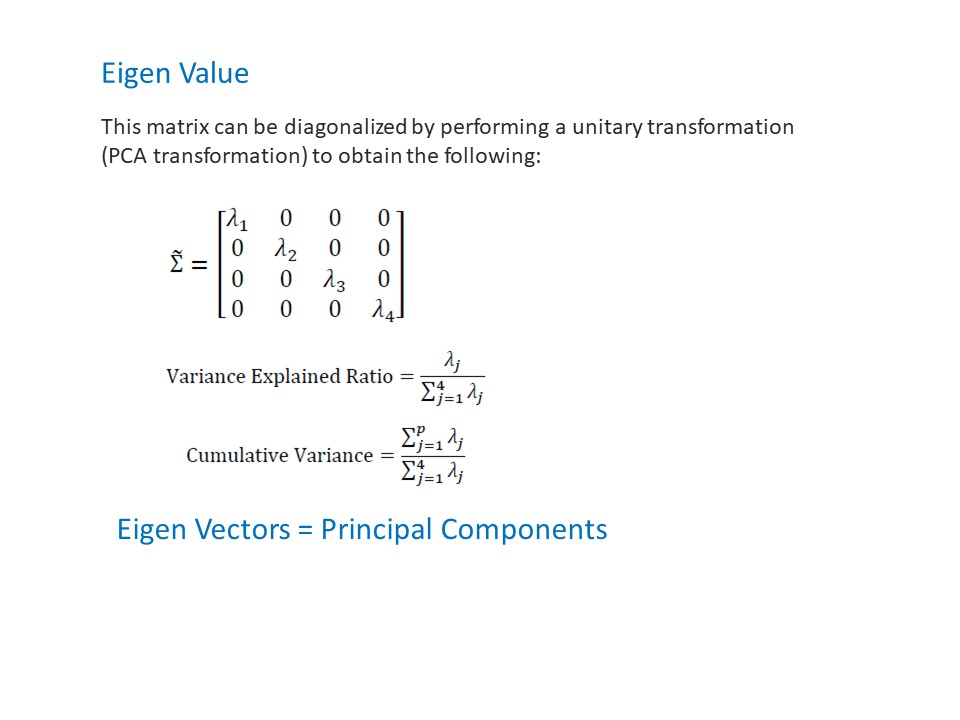

# PCA-on-Brain-Image
Principal component analysis (PCA) is a method of reducing the dimensionality of data and is used to improve data visualization and speed up machine learning model training.

## Mathematics Behind PCA:

PCA can be thought of as an unsupervised learning problem. 
1. Compute the mean for every dimension of the whole dataset.
2. Compute the covariance matrix of the whole dataset.
3. Compute eigenvectors and the corresponding eigenvalues.
4. Sort the eigenvectors by decreasing eigenvalues and choose k eigenvectors with the largest eigenvalues to form a d × k dimensional matrix W.
5. Use this d × k eigenvector matrix to transform the samples onto the new subspace.

PCA on brain image

